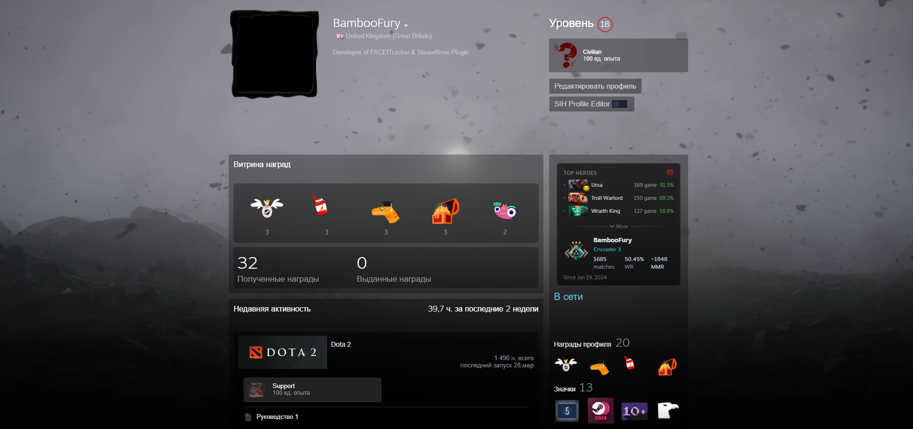

<div align="center">

# Dota 2 OpenDota Stats for Millennium

Компактный виджет со статистикой Dota 2 прямо на странице Steam‑профиля.

<br/>

<!-- Здесь можно прикрепить скриншот карточки плагина -->


</div>

---

## ⚡ About

Плагин для [Steam Millennium](https://github.com/SteamClientHomebrew/Millennium), который интегрирует виджет Dota 2 прямо в профиль Steam.

**Что делает плагин:**

- **Ранг и медаль** Dota 2 с локальными иконками (Steam `steamui/DotaRanks`).
- **Русская подпись ранга**: Рекрут, Страж, Рыцарь, Герой, Легенда, Властелин, Божество, Титан.
- **MMR**:
  - использует `mmr_estimate`/`solo_competitive_rank`, если доступны в OpenDota;
  - если нет — считает **примерный MMR по рангу и количеству звёзд**.
- Статистика в одной строке: `Matches / MMR / WR`.
- Если статы в OpenDota скрыты — показывает `Matches: скрыто`, `WR: скрыто`.
- Кнопка для быстрого перехода на **OpenDota**.
- Иконка‑ярлык на **Dotabuff** в правом верхнем углу карточки.

> Данные берутся из OpenDota и **могут отличаться от клиента Dota 2**.

---

## 📥 Installation

> Рекомендуется ставить только из доверенных источников. Проверяйте код перед установкой.

1. Скачайте последнюю сборку плагина (`dotastats-x.y.z.zip`).
2. Распакуйте содержимое архива в папку плагинов Steam:
   - по умолчанию на Windows: `C:\Program Files (x86)\Steam\plugins\dotastats`.
3. Убедитесь, что структура выглядит примерно так:

   ```text
   Steam/
    └─ plugins/
       └─ dotastats/
          ├─ backend/
          ├─ static/
          ├─ .millennium/Dist/webkit.js
          ├─ plugin.json
          └─ ...
   ```

4. Перезапустите Steam с установленным Millennium.
5. Откройте настройки Millennium и включите плагин **Dota 2 OpenDota Stats**.

---

## 🛠 Building

Клонирование репозитория:

```bash
git clone https://github.com/BambooFury/dotastats.git
cd dotastats
```

Установка зависимостей и сборка фронтенда:

```bash
npm install
npm run build
```

Команда `npm run build` минифицирует `webkit.dev.js` в `.millennium/Dist/webkit.js` с помощью [terser](https://github.com/terser/terser).

После сборки переместите папку `dotastats` в каталог плагинов Steam (см. раздел Installation).

---

## 📎 Notes

- Плагин использует **WebKit** Millennium, чтобы внедрять JavaScript непосредственно в браузер Steam.
- Не устанавливайте плагины из недоверенных источников — они имеют доступ к содержимому страниц Steam.
- При большом количестве профилей с закрытой статистикой возможны расхождения между данными Dota 2, OpenDota и Dotabuff.

**Пути Millennium по умолчанию:**

- **Windows:** `C:\Program Files (x86)\Steam`  → плагины в `Steam/plugins`.
- **Unix:** `~/.millennium` (если вы используете Millennium там).

---

## 📜 License

Проект распространяется по лицензии **MIT**. Подробности см. в файле [LICENSE](LICENSE).

