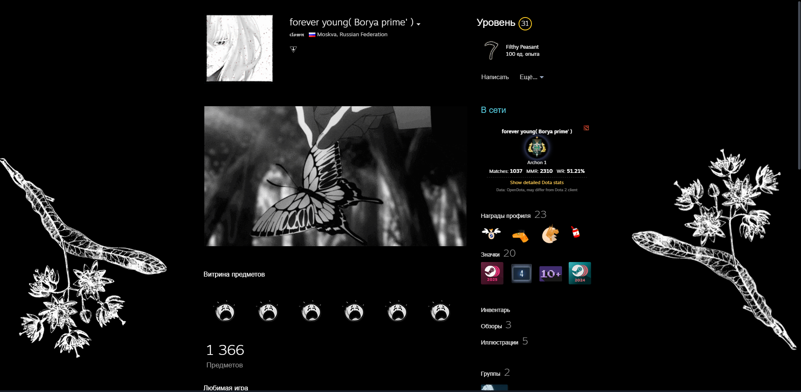

# Dota 2 Stats for Millennium

A [Millennium](https://steambrew.app/) plugin that displays Dota 2 player statistics directly on Steam profile pages.

 

---

## Features

- **Rank Medal Display** — Shows your current Dota 2 rank with official medal icons
- **MMR Estimation** — Displays MMR from OpenDota or calculates approximate value from rank
- **Match Statistics** — Total matches played and win rate percentage
- **Leaderboard Position** — Shows top rank position for Immortal players
- **Quick Links** — One-click access to your OpenDota and Dotabuff profiles
- **Works Everywhere** — Compatible with Steam Desktop and Overlay browser

## Installation

### Method 1: Millennium Plugin Installer (Recommended)

1. Open Steam with Millennium installed
2. Go to **Steam** → **Millennium** → **Plugins**
3. Click **Install a plugin**
4. Search for "Dota 2 Stats" and click **Install**
5. Restart Steam when prompted

### Method 2: Manual Installation

1. Download the latest release from [Releases](https://github.com/BambooFury/Dota-Stats/releases)
2. Extract to your Steam plugins folder:
   - **Windows:** `C:\Program Files (x86)\Steam\plugins\dotastats`
   - **Linux:** `~/.millennium/plugins/dotastats`
3. Restart Steam
4. Enable the plugin in Millennium settings

## License

This project is licensed under the MIT License - see the [LICENSE](LICENSE) file for details.
