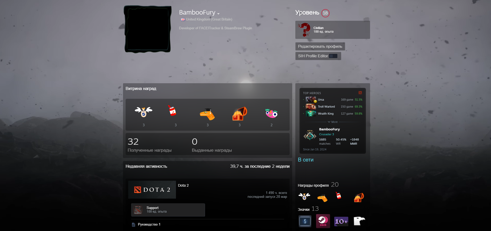
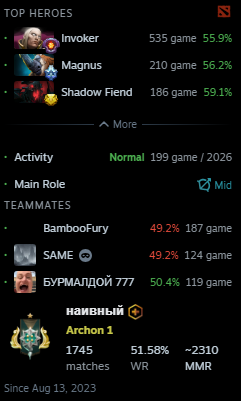

# Dota 2 Stats for Millennium

A [Millennium](https://steambrew.app/) plugin that displays Dota 2 player statistics directly on Steam profile pages.

 

<table>
  <tr>
    <td></td>
    <td valign="top"></td>
  </tr>
</table>

---

## Features

- **Rank & MMR** — Official medal icon with rank name, stars, and approximate MMR
- **Match Stats** — Total matches played and overall win rate
- **Top Heroes** — 3 most played heroes with game count and win rate (color-coded green/red)
- **Main Role** — Detected from last matches via lane data (Carry / Mid / Offlane / Soft Support / Hard Support)
- **Activity** — Total games played in the current year with activity level label
- **Teammates** — Top 3 most frequent teammates from last 1000 matches with win rate
- **Dota Plus** — Hero mastery badge shown on hero portrait
- **Leaderboard** — Rank position displayed for Immortal players
- **Dotabuff Link** — Quick access icon on the Top Heroes section
- **Private Profile** — Gracefully handled with a private badge

## Installation

### Method 1: Millennium Plugin Installer (Recommended)

1. Open Steam with Millennium installed
2. Go to **Steam** → **Millennium** → **Plugins**
3. Click **"Install a plugin"**
4. Enter the plugin ID and click **"Install"**
5. Restart Steam when prompte

### Method 2: Manual Installation

1. Download the latest release from [Releases](https://github.com/BambooFury/Dota-Stats/releases)
2. Extract to your Steam plugins folder:
   - **Windows:** `C:\Program Files (x86)\Steam\plugins\dotastats`
3. Restart Steam and enable the plugin in Millennium settings

## License

MIT — see [LICENSE](LICENSE) for details.
